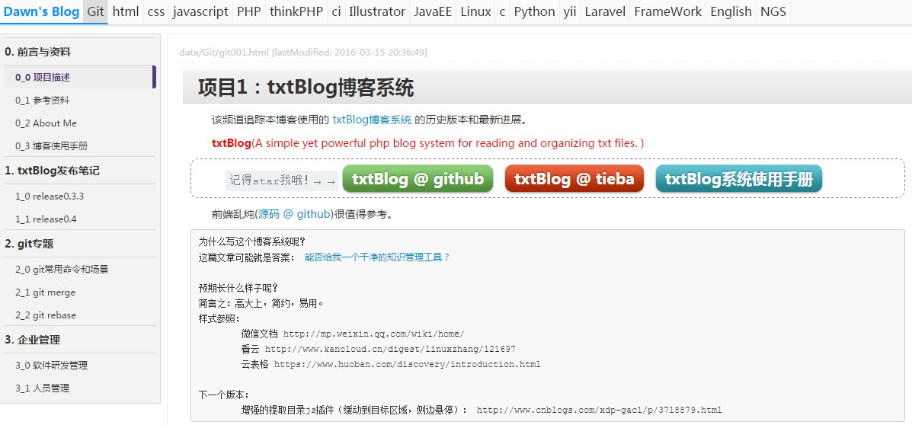

txtBlog v0.6
===============================
	-- A simple yet powerful blog system for reading and organizing txt files based on PHP. 

# 目的：建立一个能组织和阅读txt文件的博客系统，用于管理知识。  




## 用户方面：  
	1.单用户自用博客；其他人可以浏览。  
	
## 交互：  
	2.评论有待开发。前期采用多说。  
	
## 数据存储：  
	3.不用mysql，基于文件系统。目录用文件保存，采用array格式。  
		图片：  
		文本编辑器：  
		样式表：支持几种基本设置：标题、正文、段落、图片、代码、强调、  
		支持txt文本简单解析、自动生成标题  
		markdown格式解析和样式表，代码自动高亮，自动生成标题，左下角目录响应滚轮
		[v6.2.8-2]为txt添加左下角目录，响应滚轮;		
		
## UI布局：  
	4.顶部是自定义关键词（如js、php等），  
		左边是自定义菜单；  
		[todo]支持二级菜单；  
		右边是正文；  

## 系统架构：  
	5.采用MVC；  
	6.要扩展性强：可以自动生成应用目录、管理多个记事本【未实现】  
	7.目录结构清晰。  

## 兼容性：  
	8.主流浏览器（PC端的chrome，移动端UC、腾讯浏览器）  

## 优化：  
	9.全站缓存60s。 已取消缓存，没必要; 
	
## 
#


## 事故：
	2016-4-13之后，80端口被封，该网站变成了局域网。  
		怎么能突破局域网的限制？  
		- 花生壳？ 


# 部署到阿里云虚拟主机(2018.11.7)
	1.先把blog二级域名解析到空间，再绑定到阿里云空间
	2.子域名指向子目录：在根目录htdocs下创建文件.htaccess，内容如下。
```
RewriteEngine On
RewriteBase /
# 绑定 blog.applymed.cn 到子目录 txtBlog
RewriteCond %{HTTP_HOST} ^blog.applymed.cn$ [NC]
RewriteCond %{REQUEST_URI} !^/txtBlog/
RewriteRule ^(.*)$ /txtBlog/$1 [L,QSA]
#可以绑定多个，只需要重复以上三行代码，并更改一下域名、目录名 就好了
```		
	3.折腾了半天无法显示，最后发现是缓存实现不了。先注释掉index.php中的两行缓存后，一切正常显示了。
	4.网址： http://blog.applymed.cn/


## 参考资料：  
Markdown解析器: [HyperDown](https://github.com/SegmentFault/HyperDown)  
代码高亮: [highlight.js](https://github.com/andris9/highlight)  


``````
添加$ git remote add origin git@github.com:DawnEve/txtBlog.git
首次$ git push -u origin master

$ git branch
$ git checkout master
合并$ git merge --no-ff -m'some comments' otherBranch
推送$ git push origin master


除了默认控制器，还有其他控制器：
/index.php?c=outline&k=php&id=1_1  php的大纲
/index.php?c=summary&k=2015 年度总结

``````
